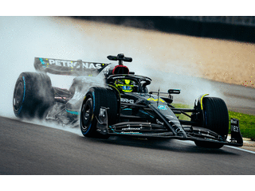
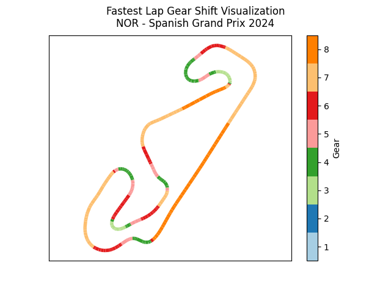
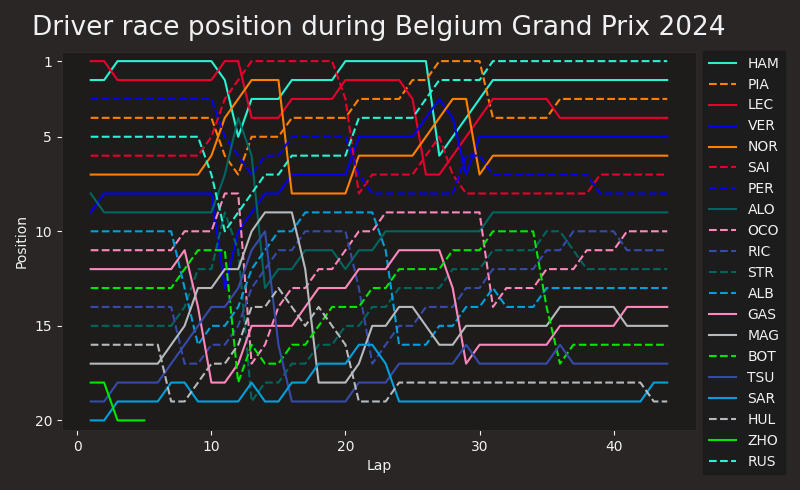
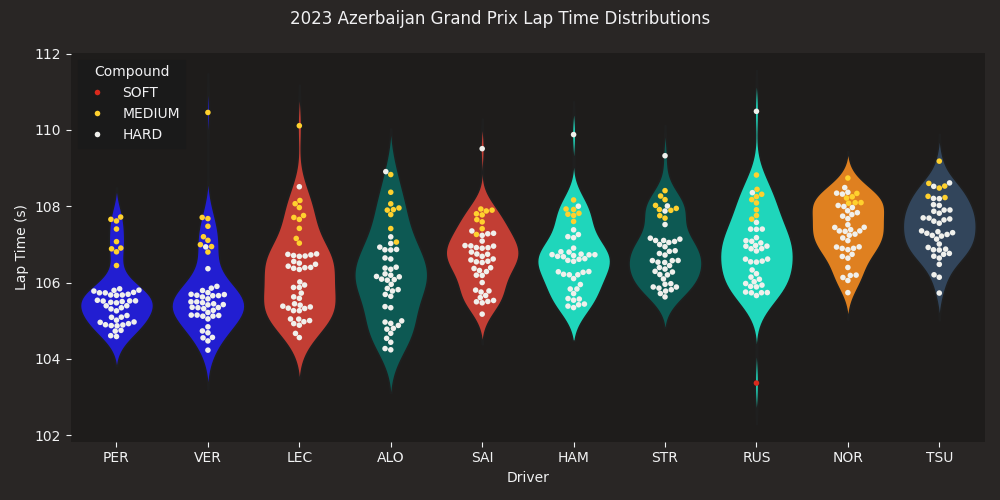
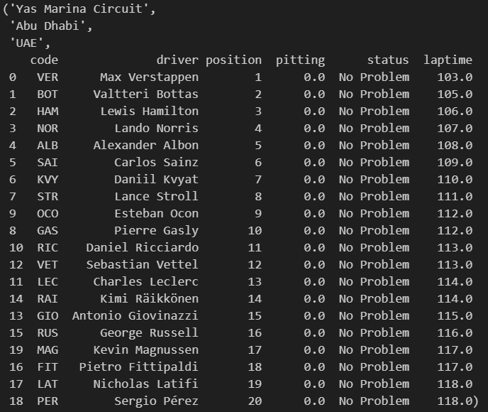
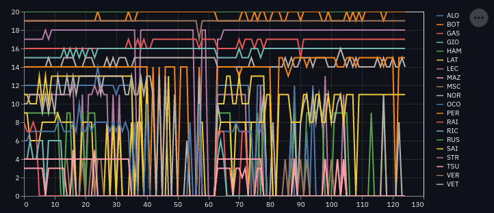

# Formula One Race Predictor

## Introduction

Welcome to the F1 Race Winner Predictor repository! This project utilizes data mined from [Ergast Developer API](http://ergast.com/mrd/) and Pytorch to predict the outcomes of overall F 1 races and lap by lap predictions , merging the thrill of motorsports with the cutting-edge world of machine learning.

****

## Project Overview

This project was born out of true passion for both Formula 1 racing and the possibilities within the realm of artificial intelligence. By analyzing historical race data [1950-2024], the project goal is to build a model that can predict race outcomes with a reasonable degree of accuracy.

This project features two machine learning models that can predict race outcomes and lap times, positions, pit stop strategies for up to 20 drivers throughout a whole race.

## F1 Data
Data scraped from F1 official website through FastF1 API and Ergast Developer API. 
Dataset contains F1 race history from 1950 - 2024
- circuits
- constructors
- drivers
- lap_times
- pit_stops
- qualifying
- races
- seasons

## Tech Stack
- requirements.txt

## Two Working Models
- Neural Networks for race outcome prediction
- LSTM for lap times, status, positions and pit stop strategies trained on the past 24 years of data

## Demo

## Data Visualization

### - Gear shifts over the course of single lap

### - Driver position in the race

### - Lap time distribution over the race 

## Predictions

### Model Predictions

### - Abu Dhabi Grand Prix Prediction

### - Driver position over the duration of race

## More information on the models [here](./Models/README.md).

